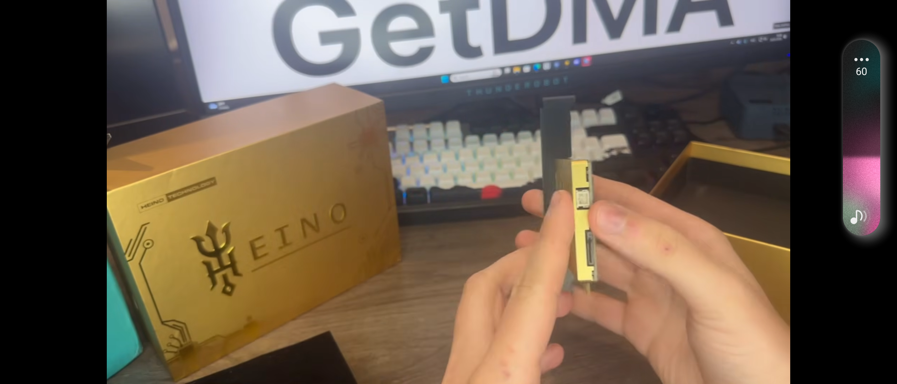
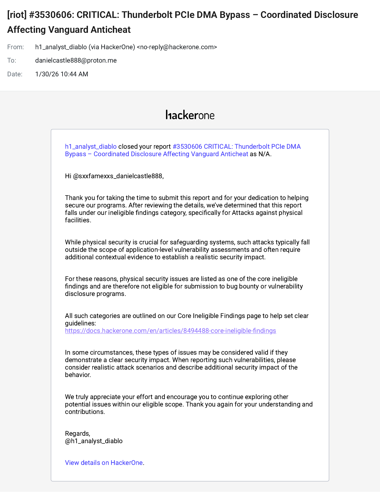
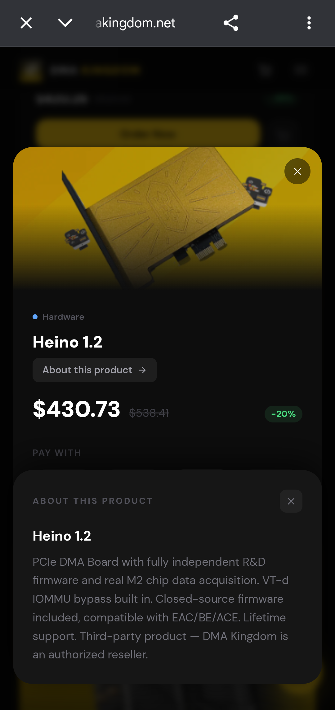
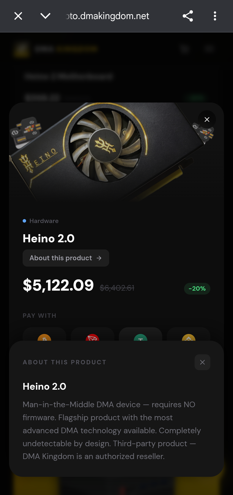
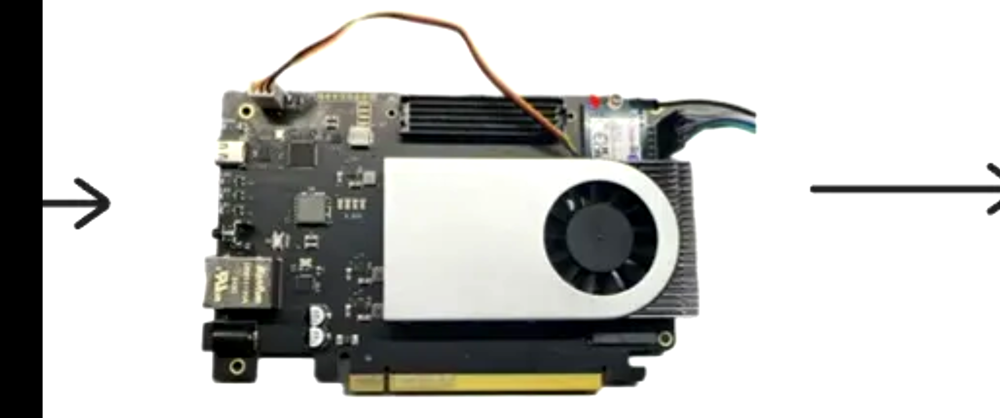
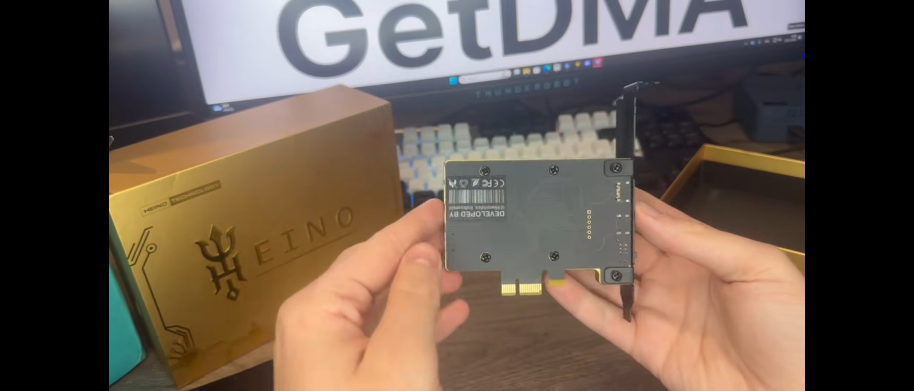
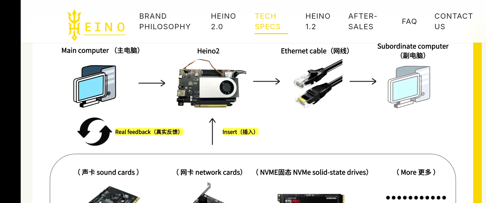

# Heino DMA / PCIe MITM Bypass — Disclosure & Vindication

**April 11, 2026** — Commercial products are now selling that implement the exact architecture I disclosed to Riot Games and other anticheat vendors in January 2026. They declined to engage. Three months later the hardware is on the market.

This repo documents what I reported, when I reported it, and what happened after.

---



---

## What I Disclosed in January 2026

I submitted a coordinated disclosure to major anticheat vendors describing a PCIe Man-in-the-Middle hardware attack. The core of it:

A device sits in a PCIe slot and mirrors the identity of a real, legitimate piece of hardware — an NVMe drive, a network card, whatever. The system sees only the legitimate device. The MITM chip sits transparently in between, reading memory via DMA while the real device continues to function normally. No firmware modifications. No software on the target machine. No driver signatures to flag. The game can even run directly from the device, which makes it a perfect cover.

I told them this would reach commercial products within 6 to 12 months. I offered consulting to help build detection before that happened — $50k to $150k for a 90-day head start.

They said no.

---

## Riot's Response

I filed under HackerOne ticket #3530606. Here is the actual response:




That was January 2026.

---

## What Happened Three Months Later



**Heino 1.2** — $430.73

"PCIe DMA Board with fully independent R&D firmware and real M2 chip data acquisition. VT-d IOMMU bypass built in. Closed-source firmware included, compatible with EAC/BE/ACE. Lifetime support."



**Heino 2.0** — $5,122.09

"Man-in-the-Middle DMA device — requires NO firmware. Completely undetectable by design. Third-party product — DMA Kingdom is an authorized reseller."

From their own site:

> "As the world's only MITM hardware device, Heino 2.0 breaks free from traditional DMA limitations."

> "Through Man-in-the-Middle attacks, Heino 2.0 enables full functionality of any PCIe device — acting as genuine hardware."

> "If the game is running directly from the H2 hard drive, how could it possibly be identified as a third-party plugin?"

That last line is word for word the cover story I described in my disclosure.

---

## The Hardware







Their own diagram shows it: main PC, MITM chip in the PCIe slot, ethernet out to a secondary machine. That is the exact architecture I described.

---

## How It Works

```
┌─────────────────────────────────────────────────────┐
│ MOTHERBOARD PCIe SLOT                               │
│                                                     │
│  System sees only the legitimate device             │
│                                                     │
│ ┌─────────────────────────────────────┐            │
│ │ HEINO 2.0 MITM CHIP                 │            │
│ │                                     │            │
│ │  mirrors device identity            │────eth/USB──> secondary PC
│ │  transparent passthrough            │             │
│ │  DMA memory reads                   │            │
│ └─────────────────────────────────────┘            │
│                                                     │
│ ┌─────────────────────────────────────┐            │
│ │ REAL PCIe DEVICE                    │            │
│ │ (NVMe, GPU, NIC, etc.)              │            │
│ └─────────────────────────────────────┘            │
└─────────────────────────────────────────────────────┘
```

Why current anticheats miss it:

- Real device drivers, Microsoft-signed
- Real device firmware — Samsung, Intel, etc.
- Device identity cloned, passes PCIe enumeration
- Game can run from the device itself
- Nothing installed on the target machine
- DMA traffic looks like normal device memory access
- No IOMMU bypass needed

---

## Why It Can Be Detected

The device has to exfiltrate data somehow. That means it needs a second channel out — USB 3.2 or ethernet — running at the same time as the PCIe slot.

Legitimate NVMe drives and GPUs do not do that. A storage device that is also pushing high-bandwidth traffic out a USB port is not a storage device.

That is the detection vector. See [DETECTION.md](DETECTION.md) for implementation.

---

## What I Predicted vs. What Shipped

| My January Disclosure | Heino Products (April 2026) |
|---|---|
| PCIe passthrough / MITM architecture | "MITM hardware device" — their words |
| Legitimate device as cover | "Acting as genuine hardware" |
| Device identity cloning | "Full functionality of any PCIe device" |
| Undetectable by current methods | "0% detection rate" |
| Game runs from the device | "Game running from H2 hard drive" |
| No firmware needed | "Requires NO firmware" |
| Uses real signed drivers | Confirmed |
| 6–12 months to commercial products | 3 months — faster than I predicted |
| $5k+ premium tier | $5,122 for Heino 2.0 |

---

## The Scale

From Heino's own marketing:

> "Heino 1.0 generated a $20 million market, and we reinvested half of that revenue into developing Heino 2.0."

At roughly $400 a unit that is 50,000 devices. The market they said would not exist already exists at scale.

---

## Where Things Stand

I gave anticheat vendors a 3-month head start. They passed. The products launched anyway, exactly as described, and are now selling openly on multiple storefronts.

I am publishing the detection research now because the threat is already public — anyone with $430 can buy one of these. The defensive methodology belongs in the hands of the people building the defenses.

**Detection research:** [DETECTION.md](DETECTION.md)

**Consulting for implementation:** danielcastle888@proton.me

Rates are no longer the proactive rates from January.

---

## Product Links

- https://heinodma.com/
- https://dmakingdom.net/
- https://project7.dev/product/heino-20
- https://ducks-services.com/

---

## Files in This Repo

- README.md — this document
- [VINDICATION.md](VINDICATION.md) — full disclosure narrative
- [DETECTION.md](DETECTION.md) — detection methodology and implementation
- [EVIDENCE.md](EVIDENCE.md) — product links, screenshots, timeline
- [DEPLOYMENT.md](DEPLOYMENT.md) — consulting and deployment notes
- images/ — product photos, architecture diagrams, Riot rejection screenshots

---

**Daniel Castellani**
Independent Security Researcher
April 11, 2026
