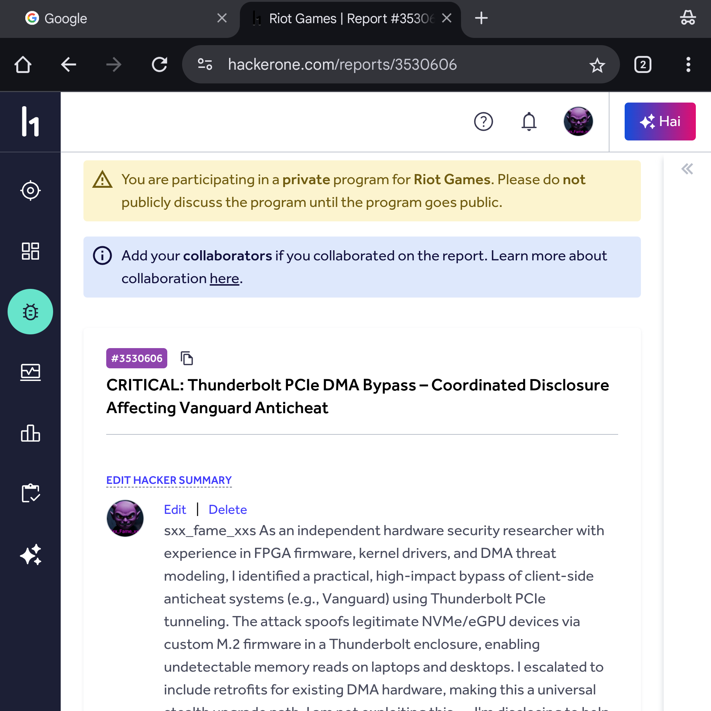
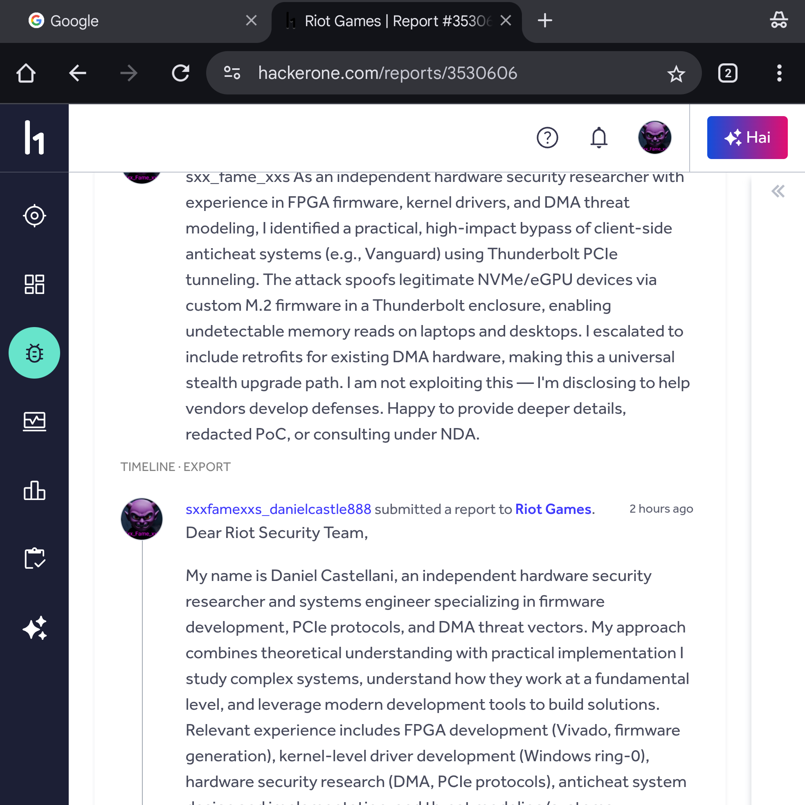
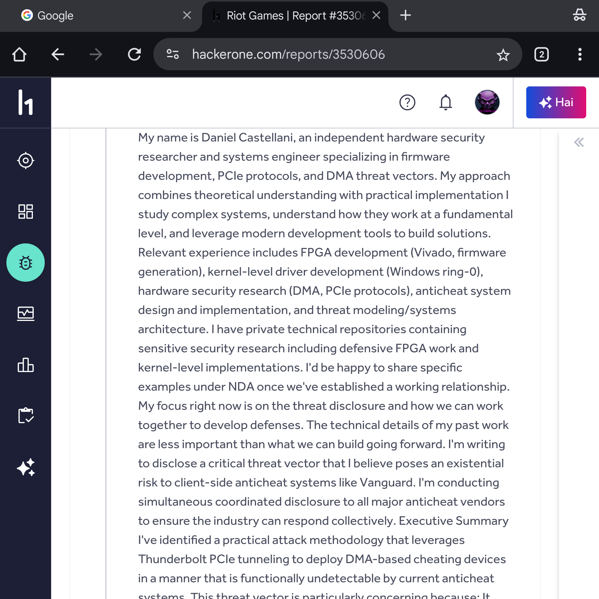
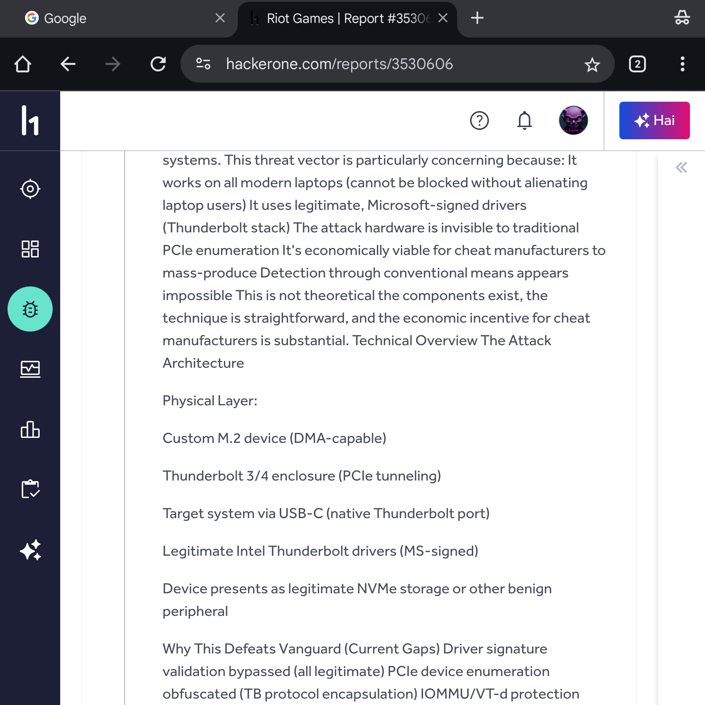
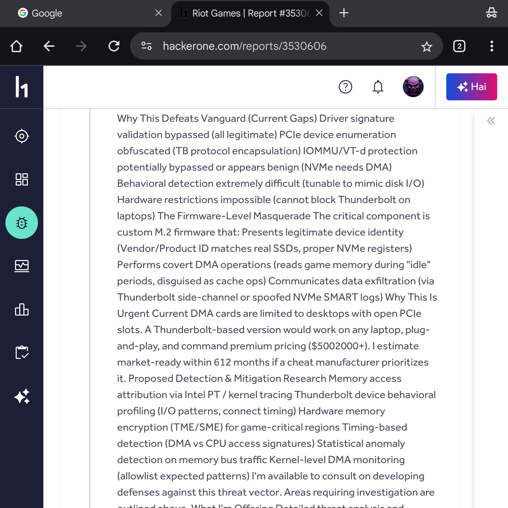
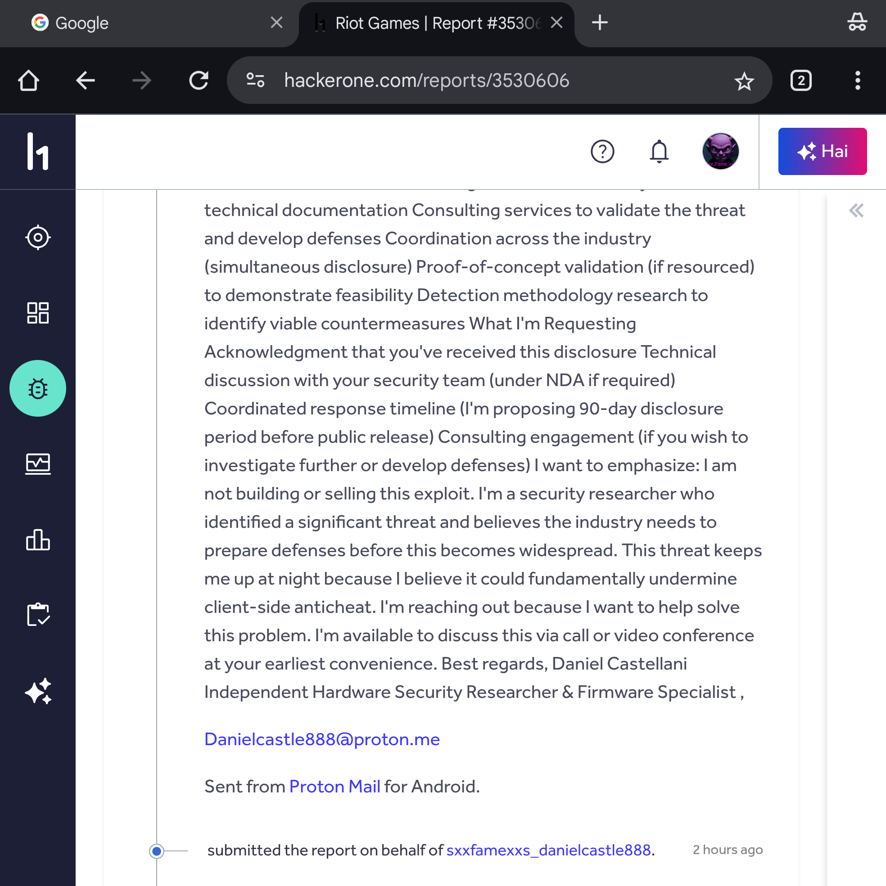
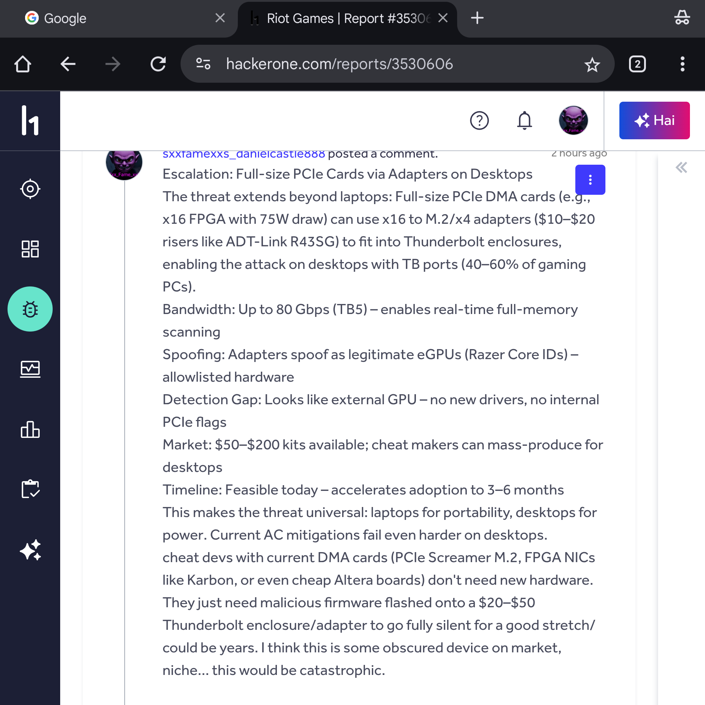
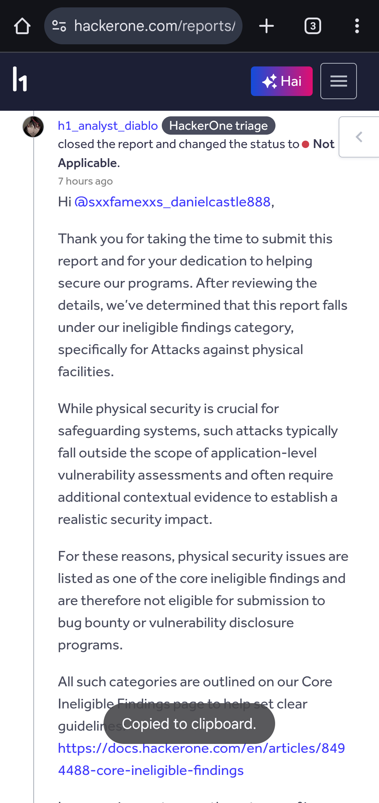
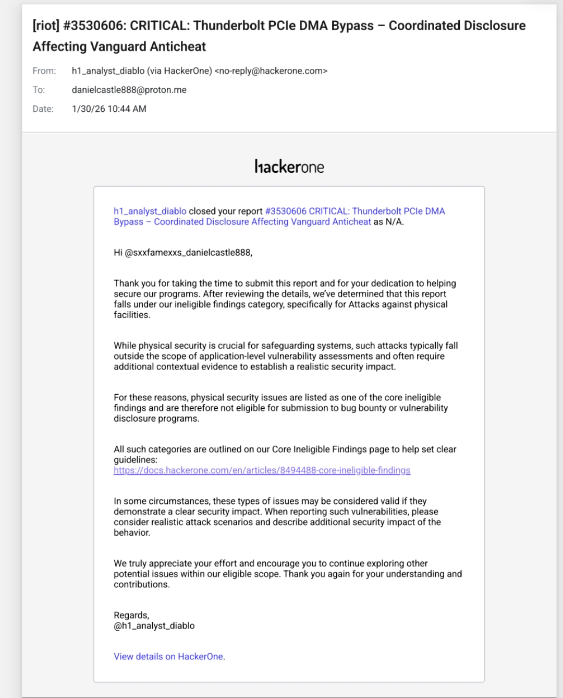
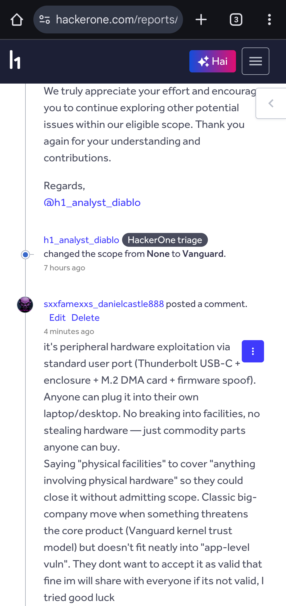

# Heino DMA / PCIe MITM Bypass — Disclosure & Vindication

**April 11, 2026** — Commercial products are now selling that implement the exact architecture I disclosed to Riot Games and other anticheat vendors in January 2026. They declined to engage. Three months later the hardware is on the market.

This repo documents what I reported, when I reported it, and what happened after.

---


---

## What I Disclosed in January 2026

I submitted a coordinated disclosure to major anticheat vendors describing a PCIe Man-in-the-Middle hardware attack. The core of it:

A device sits in a PCIe slot and mirrors the identity of a real, legitimate piece of hardware — an NVMe drive, a network card, whatever. The system sees only the legitimate device. The MITM chip sits transparently in between, reading memory via DMA while the real device continues to function normally. No firmware modifications. No software on the target machine. No driver signatures to flag. The game can even run directly from the device, which makes it a perfect cover.

I told them this would reach commercial products within 6 to 12 months. I offered consulting to help build detection before that happened. I submitted to multiple anticheat vendors simultaneously — coordinated disclosure, the way it is supposed to be done.

They did not want to talk. No technical discussion. No security team review. No follow-up questions. Just a copy-paste rejection the same day and a closed ticket.

---

## What They Chose Not to Pay

Riot's own HackerOne program had a published bounty of up to **$100,000** for high-quality Vanguard bypass research. My submission was a critical architectural bypass of Vanguard's entire kernel trust model — exactly what that bounty category describes.

Because I submitted to multiple vendors simultaneously, each had their own bounty program. Had even two or three engaged properly, the legitimate payout for work I had already completed would have been $200,000 to $300,000 or more.

Instead, they classified a PCIe DMA hardware bypass as an "Attack against physical facilities" — a category designed for things like breaking into server rooms — and closed it without a single technical question.

They saw everything. They chose not to engage. Then they closed the program.

---

## The Evidence: Timeline of a Dismissed Disclosure

### 1. The Submission (January 2026)



The report was filed as CRITICAL. The title: "Thunderbolt PCIe DMA Bypass — Coordinated Disclosure Affecting Vanguard Anticheat." Submitted to Riot Games directly via their private HackerOne program.



I explicitly stated I was not building or selling this. I was disclosing to help vendors build defenses. I offered NDA, redacted proof of concept, and consulting engagement.











The report included the full attack architecture, why it defeats Vanguard's kernel trust model, a detection methodology, and a market timeline prediction of 6 to 12 months to commercial availability.

### 2. The Rejection



`h1_analyst_diablo` closed the report as Not Applicable under "Attacks against physical facilities." No technical discussion. No questions. Same day.



The email arrived January 30, 2026. The program shut down shortly after.

### 3. My Response on the Ticket



I called it out directly: "Saying 'physical facilities' to cover 'anything involving physical hardware' so they could close it without admitting scope. Classic big-company move when something threatens the core product but doesn't fit neatly into 'app-level vuln.'"

That is exactly what happened.

---

## What Happened Three Months Later


**Heino 1.2** — $430.73

"PCIe DMA Board with fully independent R&D firmware and real M2 chip data acquisition. VT-d IOMMU bypass built in. Closed-source firmware included, compatible with EAC/BE/ACE. Lifetime support."


**Heino 2.0** — $5,122.09

"Man-in-the-Middle DMA device — requires NO firmware. Completely undetectable by design."

From their own site:

> "As the world's only MITM hardware device, Heino 2.0 breaks free from traditional DMA limitations."

> "Through Man-in-the-Middle attacks, Heino 2.0 enables full functionality of any PCIe device — acting as genuine hardware."

> "If the game is running directly from the H2 hard drive, how could it possibly be identified as a third-party plugin?"

That last line is word for word the cover story I described in my disclosure.

---

## The Hardware


Their own diagram shows it: main PC, MITM chip in the PCIe slot, ethernet out to a secondary machine. That is the exact architecture I described.

---

## How It Works

```
┌─────────────────────────────────────────────────────┐
│ MOTHERBOARD PCIe SLOT                               │
│                                                     │
│  System sees only the legitimate device             │
│                                                     │
│ ┌─────────────────────────────────────┐            │
│ │ HEINO 2.0 MITM CHIP                 │            │
│ │                                     │            │
│ │  mirrors device identity            │────eth/USB──> secondary PC
│ │  transparent passthrough            │             │
│ │  DMA memory reads                   │            │
│ └─────────────────────────────────────┘            │
│                                                     │
│ ┌─────────────────────────────────────┐            │
│ │ REAL PCIe DEVICE                    │            │
│ │ (NVMe, GPU, NIC, etc.)              │            │
│ └─────────────────────────────────────┘            │
└─────────────────────────────────────────────────────┘
```

Why current anticheats miss it:

- Real device drivers, Microsoft-signed
- Real device firmware — Samsung, Intel, etc.
- Device identity cloned, passes PCIe enumeration
- Game can run from the device itself
- Nothing installed on the target machine
- DMA traffic looks like normal device memory access
- No IOMMU bypass needed

---

## Why It Can Be Detected

The device has to exfiltrate data somehow. That means it needs a second channel out — USB 3.2 or ethernet — running at the same time as the PCIe slot.

Legitimate NVMe drives and GPUs do not do that. A storage device that is also pushing high-bandwidth traffic out a USB port is not a storage device.

That is the detection vector. See [DETECTION.md](DETECTION.md) for implementation.

---

## What I Predicted vs. What Shipped

| My January Disclosure | Heino Products (April 2026) |
|---|---|
| PCIe passthrough / MITM architecture | "MITM hardware device" — their words |
| Legitimate device as cover | "Acting as genuine hardware" |
| Device identity cloning | "Full functionality of any PCIe device" |
| Undetectable by current methods | "0% detection rate" |
| Game runs from the device | "Game running from H2 hard drive" |
| No firmware needed | "Requires NO firmware" |
| Uses real signed drivers | Confirmed |
| 6–12 months to commercial products | 3 months — faster than I predicted |
| $5k+ premium tier | $5,122 for Heino 2.0 |

---

## The Scale

From Heino's own marketing:

> "Heino 1.0 generated a $20 million market, and we reinvested half of that revenue into developing Heino 2.0."

At roughly $400 a unit that is 50,000 devices. The market they said would not exist already exists at scale.

---

## Where Things Stand

I gave anticheat vendors a 3-month head start. They passed. The products launched anyway, exactly as described, and are now selling openly on multiple storefronts — DMAKingdom, FTWDMA, and others.

I am publishing the detection research now because the threat is already public. Anyone with $430 can buy one of these. The defensive methodology belongs in the hands of the people building the defenses, not sitting in a closed HackerOne ticket.

**Detection research:** [DETECTION.md](DETECTION.md)

**Consulting for implementation:** danielcastle888@proton.me

Rates are no longer the proactive rates from January.

---

## Product Links

- https://heinodma.com/
- https://dmakingdom.net/
- https://project7.dev/product/heino-20
- https://ducks-services.com/

---

## Files in This Repo

- README.md — this document
- [VINDICATION.md](VINDICATION.md) — full disclosure narrative
- [DETECTION.md](DETECTION.md) — detection methodology and implementation
- [EVIDENCE.md](EVIDENCE.md) — product links, screenshots, timeline
- [DEPLOYMENT.md](DEPLOYMENT.md) — consulting and deployment notes
- evidence/ — HackerOne submission screenshots, rejection, and rebuttal
- images/ — product photos and architecture diagrams

---

**Daniel Castellani**
Independent Security Researcher
April 11, 2026


## The Next Frontier: M.2 Firmware Shimming and Virtual DMA Space

While the current generation of PCIe MITM DMA devices, like the Heino 2.0, represent a significant leap in undetectable cheating, the true "endgame" for anticheat lies in the weaponization of existing, legitimate hardware at the firmware level. This is the next frontier, and it makes current DMA detection methods obsolete.

Imagine a standard M.2 NVMe drive, indistinguishable from any other, but with its firmware subtly modified. This isn't about an external card; it's about turning the storage controller itself into a stealthy cheat engine. Here's the theoretical architecture:

### M.2 Firmware Shimming

1.  **Hidden Virtual DMA Space:** The NVMe drive's firmware is modified to carve out a small, isolated section of its own memory or a dedicated buffer. This space is invisible to the operating system and anticheat software, as it's managed entirely by the custom firmware.
2.  **Interleaved Memory Reads:** The modified firmware can perform DMA reads from system memory (e.g., game state, player positions) and store them in its hidden virtual space. These reads are interleaved with legitimate disk I/O operations, making them appear as normal storage activity. To the system, it just looks like the SSD is busy.
3.  **PCIe Lane Manipulation:** To further evade detection, the firmware could selectively disable or reroute a single PCIe lane. This creates a subtle anomaly that is incredibly difficult to detect without specialized hardware analysis, as the device still functions as a legitimate NVMe drive.
4.  **Data Exfiltration:** Data from the hidden virtual space can be exfiltrated through the NVMe drive's existing interface (e.g., via specific NVMe commands, or even through a side-channel if the drive has an auxiliary USB or Ethernet port for management, as some enterprise drives do). This exfiltration would again be masked as legitimate storage traffic.

### Why This is a Nightmare for Anticheat

*   **No External Hardware:** There's no suspicious external device, no Thunderbolt enclosure, no unique device IDs to flag. It's just a regular M.2 NVMe drive.
*   **Legitimate Drivers & Firmware:** The device uses standard, Microsoft-signed NVMe drivers. The underlying hardware is legitimate, and its firmware appears to be legitimate (though subtly modified).
*   **Deep Stealth:** The cheat operates at Ring -3 (firmware level), below the operating system and even the kernel-level anticheat. It's effectively invisible.
*   **Exploiting Trust:** Anticheat systems inherently trust legitimate storage devices. This attack exploits that fundamental trust.

This approach transforms a common, trusted component into an undetectable cheat. While the industry is still grappling with external DMA, the true threat lies in the silent, firmware-resident modifications that turn everyday hardware into a weapon. This is the future that needs to be defended against, and it highlights the critical importance of understanding hardware at its deepest levels.
